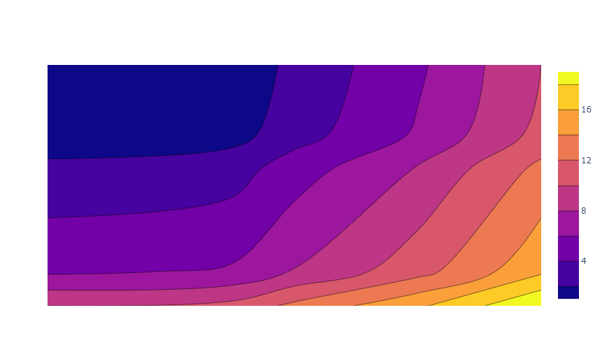
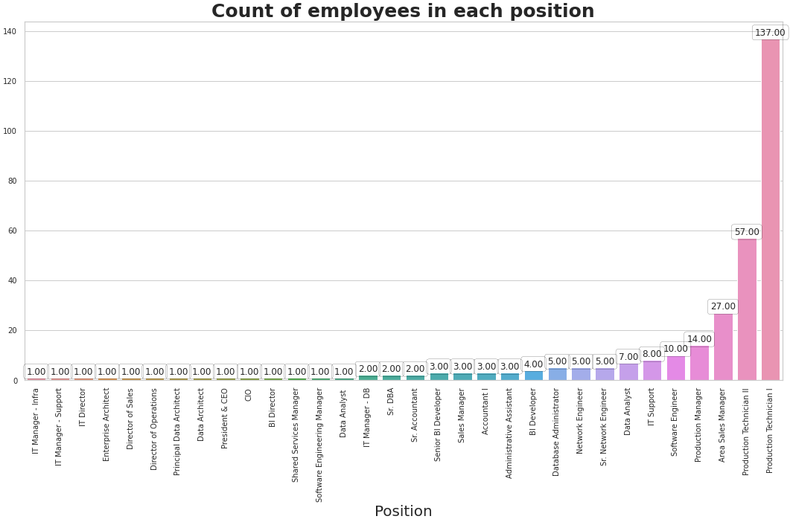
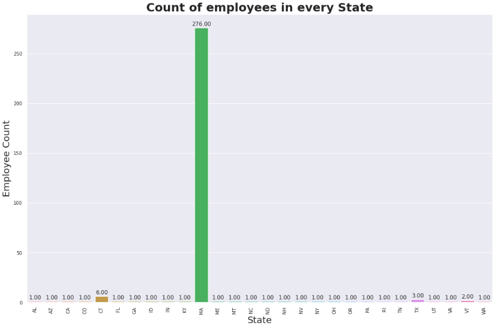
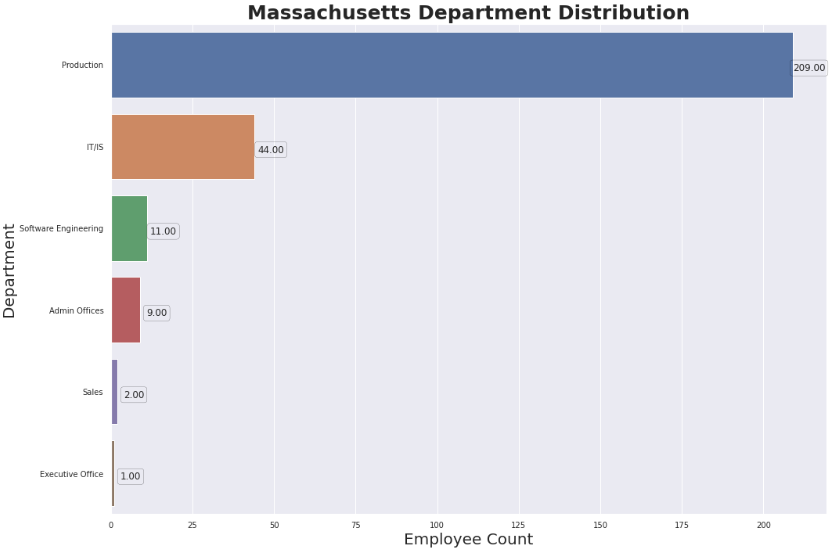
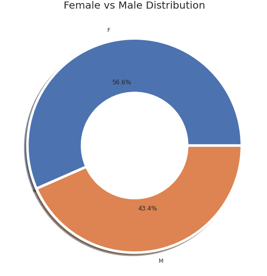
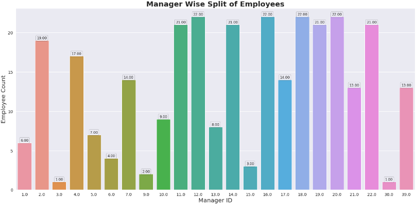
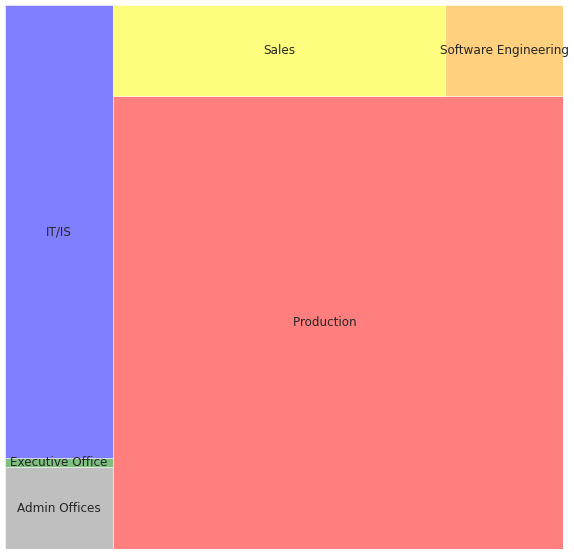
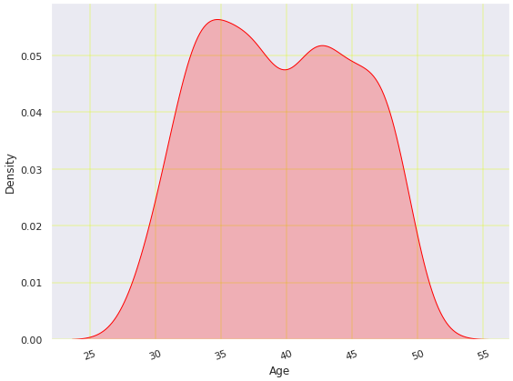

# Human Resources Data Analysis



This project analyzes human resources data to gain insights into the company's workforce and performance. The dataset used in this analysis can be found [here](link-to-dataset).

## Table of Contents
1. [Introduction](#introduction)
2. [Installation](#installation)
3. [Usage](#usage)
4. [Data](#data)
5. [Analysis](#analysis)
6. [Results](#results)
7. [Algorithms](#algorithms)
8. [Libraries Used](#libraries-used)
9. [Methods](#methods)
10. [Figures](#figures)
11. [Future Work](#future-work)
12. [Contributing](#contributing)
13. [License](#license)
14. [Acknowledgments](#acknowledgments)
15. [Contact](#contact)

## Introduction

This project is a detailed analysis of human resources data, aiming to uncover valuable insights into employee demographics, performance, and company operations. The analysis involves exploring various aspects of the dataset, from employee positions to performance scores, department distribution, and more.

## Installation

To run the code for this analysis, you'll need the following libraries. Install them using `pip`:

```bash
pip install pywaffle
pip install matplotlib
pip install seaborn
pip install squarify
pip install plotly
```

## Usage

1. Clone this repository to your local machine.
2. Install the required libraries as mentioned in the Installation section.
3. Run the analysis script using a Python environment.
4. Explore the code and visualizations to gain insights from the HR dataset.

## Data

The dataset used in this analysis contains information about employees, including attributes such as employee ID, position, gender, age, salary, and performance scores. The data is available in CSV format.

## Analysis

The analysis includes the following sections:
1. Count of employees in each position.
2. Count of employees in every state.
3. Female-Male gender ratio within the company.
4. Employee count under each manager.
5. Department-wise count of employees.
6. Age distribution of employees.
7. Probability distribution of pay rate among various employees.
8. Pay rate with respect to the manager working under.
9. Performance score manager-wise.
10. Relationship between date of termination and manager.
11. Employees leaving from a particular department.
12. Employees joining the company per year.

## Results

The key findings from the analysis are as follows:
- Majority of employees are in the "Production Technician" position.
- Massachusetts has the highest number of employees.
- There are more female employees than males in the company.
- Some managers have fewer employees working under them.
- The production department has the most employees.
- The majority of employees are middle-aged.
- Women are generally given higher-paid jobs.
- The highest-paid employee works under Manager ID 9.
- Manager ID 18 has a well-balanced team of employees.
- Employees with higher performance scores are more numerous.
- The top three reasons for leaving are career growth, lack of job satisfaction, and higher salary offers.
- The Production Department has a high employee turnover.
- The year 2011 had the highest number of new hires.

## Algorithms

The analysis mainly involves data exploration and visualization using Python libraries, including Pandas, Matplotlib, Seaborn, and Plotly. No specific algorithms are used.

## Libraries Used

- Pandas
- Matplotlib
- Seaborn
- Squarify
- Plotly
- PyWaffle

## Methods

Various methods are used for data manipulation, visualization, and analysis. The methods include grouping, sorting, plotting, and statistical analysis of the data.

## Figures

### Figure 1: Count of Employees in Each Position


### Figure 2: Count of Employees in Every State


### Figure 3: Massachusetts Department Distribution


### Figure 4: Female vs Male Distribution


### Figure 5: Manager Wise Split of Employees


### Figure 6: Department wise count of employees.


### Figure 7: Age Distribution of employees.



## Future Work

Future analysis considerations:
- Analyze the relationship between recruitment sources and employee performance.
- Investigate the relationship between employees arriving late and performance.
- Study the correlation between performance scores and salary.

## Contributing

Contributions to this project are welcome. Please fork the repository and submit a pull request with your changes.


## Acknowledgments

We would like to acknowledge the data source and the Python community for providing open-source libraries for data analysis and visualization.

## Contact

For questions or feedback, you can contact [Shakiba Sabri] at [sabrishakiba@gmail.com].
